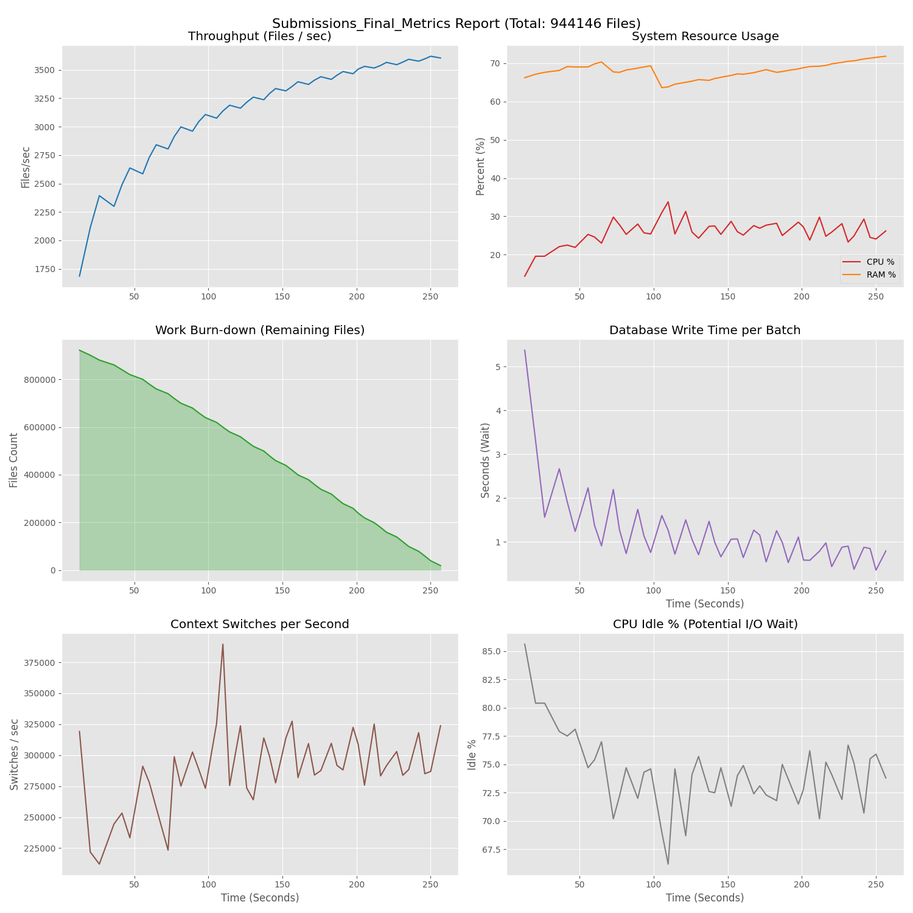
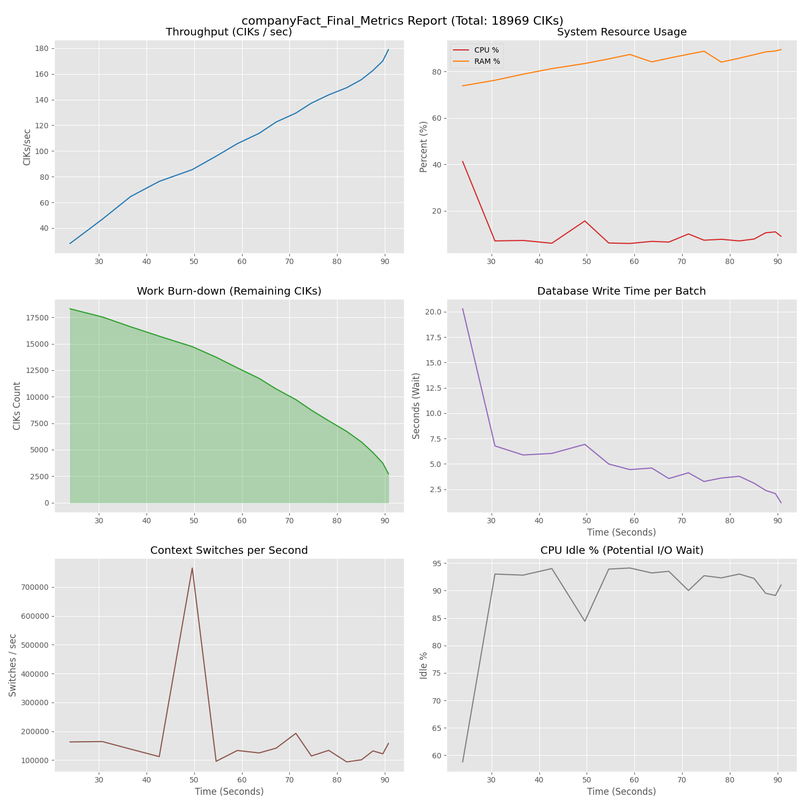

# Once4All-SEC-Data-Lak
**High-Performance ETL / Data Ingestion Prototype designed to process massive SEC EDGAR financial datasets.**

## Prototype Disclaimer
โปรเจกต์นี้เป็น **Proof of Concept (PoC)** ที่พัฒนาขึ้นเพื่อทดสอบขีดจำกัดด้านความเร็วในการนำเข้าข้อมูล (Ingestion Throughput) และการจัดการ Concurrency บน Python
* **Raw Data Focus:** ระบบเน้นการทำ ELT (Extract-Load-Transform) โดยนำเข้าข้อมูลดิบ (Raw JSON) ลง Data Lake ให้เร็วที่สุดโดยยังไม่มีการ Pre-processing ซับซ้อน
* **Current Status:** โค้ดเน้นประสิทธิภาพ (Performance-first) โครงสร้างบางส่วนอาจยังต้องมีการ Refactor เพื่อความยืดหยุ่นในอนาคต

## Project Overview
เป้าหมายคือการจัดการไฟล์ JSON ข้อมูลการเงินขนาดรวมกว่า **18GB (940,000+ files)** โดยแก้ปัญหาคอขวด (Bottleneck) ของ I/O ด้วยสถาปัตยกรรม **Producer-Consumer** ผ่าน `multiprocessing` ควบคู่กับการจูน SQL Server (Bulk Merge + TABLOCK)

## Performance Benchmarks (Current State)

ทดสอบบน: AMD Ryzen 9 7950X3D (16-Core) | RAM 64GB | Samsung 990 PRO NVMe

### 1. Submissions Pipeline (Large Aggregated Files)
* **Throughput:** ~3,600 Files/sec (Processed ~944k files in 4.3 minutes)
* **Resource Usage:** **CPU ~25-30%** | **RAM ~65-70%** (See Engineering Analysis regarding the low CPU usage)
* **Metric:** 
  
### 2. Company Facts Pipeline (Small Granular Files)
* **Throughput:** Consistent handling of 18,000+ high-frequency small files.
* **Success Rate:** Handled 16,415 valid files, skipping ~13% invalid source files without interruption.
* **Metric:** 
---

## Engineering Analysis & Challenges (บทวิเคราะห์ทางเทคนิค)

จากการทดสอบ Load Test จริง พบพฤติกรรมและข้อจำกัดของสถาปัตยกรรมปัจจุบันดังนี้:

### 1. The "Main Process" Bottleneck (Why CPU is only 30%?)
* **Observation:** กราฟแสดง CPU Utilization เพียง **25-30%** แม้จะรัน 32 Threads
* **Analysis:** นี่คืออาการของ **"Worker Starvation"** เนื่องจาก Worker ทั้ง 32 ตัวประมวลผลเสร็จเร็วมาก (ด้วยพลังของ NVMe + Ryzen 9) แต่ต้อง **"รอ" (Block)** เพื่อส่งผลลัพธ์กลับไปยัง Main Process
* **Root Cause:** Main Process ทำงานแบบ Single-threaded ในการรับข้อมูล (Deserialize/Unpickle) กลายเป็นคอขวดที่ไม่สามารถรับงานทัน 32 Workers ได้ ทำให้ Workers ส่วนใหญ่สถานะเป็น Idle (ว่างงาน) ส่งผลให้ CPU Load โดยรวมไม่สูง

### 2. Memory Pressure & Backpressure
* **Observation:** กราฟ RAM พุ่งสูงขึ้นต่อเนื่อง (**~70%**)
* **Analysis:** ข้อมูลที่ Worker ส่งมาแต่ Main Process ยังประมวลผลไม่ทัน จะถูกกองค้างไว้ใน Memory Buffer (IPC Queue) ปริมาณมหาศาล ยิ่งรันนาน Memory ยิ่งบวม (Memory Bloat)

### 3. Linear Scaling vs. Exponential Potential
* **Conclusion:** ระบบยังมี **Headroom (กำลังสำรอง)** ของ CPU อีกกว่า 70% หากสามารถปลดล็อคคอขวดที่ Main Process ได้ (เช่นการแยก Consumer เป็นหลาย Process หรือทำ Batching ที่ฝั่ง Worker) ระบบมีศักยภาพที่จะทำ Throughput ได้สูงกว่านี้อีกมาก
---

## Roadmap & Proposed Solutions (แนวทางแก้ไขในอนาคต)

เพื่อแก้ปัญหาข้างต้นและรองรับการขยายตัว (Scalability) แผนการพัฒนาขั้นต่อไปคือ:

### 1. Multi-Stage Pipeline (เพิ่ม Layer การประมวลผล)
* **Concept:** แทรก Layer **"Aggregator Process"** ตรงกลางระหว่าง Worker และ Main Process
* **Benefit:** ให้ Aggregator ทำหน้าที่รวบรวมข้อมูลย่อยเป็น Batch ใหญ่ ก่อนส่งให้ Main Process เพียงครั้งเดียว เพื่อลด Context Switching และลดภาระ Serialization ของ Main Process ลง

### 2. Decoupling Ingestion & Parsing
* **Concept:** แยกงาน "อ่านไฟล์ (IO)" และ "แกะข้อมูล (CPU Bound)" ออกจากกันอย่างชัดเจน
* **Architecture:**
    * *Stage 1:* IO Workers อ่านไฟล์ดิบและโยนเข้า Shared Memory / Queue
    * *Stage 2:* Parsing Workers ดึงข้อมูลไปแปลงเป็น Object
    * *Stage 3:* DB Workers (Multiple Consumers) ช่วยกันเขียนลง Database (แทนที่จะใช้ Main ตัวเดียว)

### 3. XBRL Taxonomy Integration
* พัฒนา Schema Loader ให้รองรับกฎทางบัญชี (Taxonomy) จาก Excel เพื่อให้การ Map ข้อมูลมีความถูกต้องตามหลักการเงินมากยิ่งขึ้น

## Technical Stack
* **Core:** Python 3.12, Multiprocessing (ProcessPoolExecutor)
* **Data Handling:** orjson (Fast JSON parser), pandas
* **Storage:** Microsoft SQL Server (T-SQL Optimization)
* **Environment:** python-dotenv, PowerShell for OS Tuning
